---
output:
  html_document:
    theme: cosmo
---
## Paradoxical Tumors in Penile Cancer

### Summary
The aim of this study is to report the clinicopathologic and outcome features of superficial high-grade and deep low-grade penile squamous cell carcinomas. For this, we used a retrospectively-colleted series of patients with penile cancer, in which we identified 41 cases corresponding to 12 superficial high-grade tumors and 29 deep low-grade tumors. As outcomes we evaluated inguinal lymph node status, presence of tumor relapse, final nodal status, and cancer-specific death. Follow-up ranged from 0.8 to 386.7 months (mean, 152.5 months; median, 157.3 months). Clinicopathologic features were similar between superficial high-grade and deep low-grade tumors, except for a tendendy (Fisher’s exact P = 0.057) of the former to include tumors with a verruciform pattern of growth. A significantly higher proportion of inguinal lymph node metastasis was found in superficial high-grade tumors compared to deep low-grade tumors (80% vs. 20% respectively, Fisher’s exact P = 0.02). No significant differences were found regarding tumor relapse (Fisher’s exact P = 0.52), final nodal status (Mantel-Cox’s P = 0.42), or cancer-related death (Mantel-Cox’s P = 0.52). Our findings suggest that patients with superficial high-grade tumors may be treated differently from patients with deep low-grade tumors, at least to control short-term local disease. Prophylactic inguinal lymphadenectomuy might be indicated in cases of superficial tumors with high-grade histology while in deeply invasive low-grade penile carcinomas a more conservative approach may be considered.

### Description of the repository
This repository contains the full statistical analysis of the dataset that was used for the article _"Clinicopathologic and Outcome Features of Superficial High-Grade and Deep Low-Grade Squamous Cell Carcinomas of the Penis"_. The article is currently under consideration of publication. This repository also contains the following files:

* The final PDF version of the [article](https://github.com/alcideschaux/Penis-Paradoxical/blob/master/Article/Paradoxical_Tumors.pdf), as submitted for consideration of publication
* The [BibTeX](https://github.com/alcideschaux/Penis-Paradoxical/blob/master/Article/References.bib) file containing all the references cited in the article
* The [R script](https://github.com/alcideschaux/Penis-Paradoxical/blob/master/Article/Paradoxical_Tumors.R) that was used for analyzing the dataset and write the article
* The [R Markdown](https://github.com/alcideschaux/Penis-Paradoxical/blob/master/README.Rmd) file used for this report
* The [figures](https://github.com/alcideschaux/Penis-Paradoxical/tree/master/figure) included in this repository in PNG format

Data were analyzed using [R](http://www.r-project.org) version 3.1.2 “Pumpkin Helmet” (R Foundation for Statistical Computing, Vienna, Austria). Results were written using RMarkDown inside [RStudio](http://www.rstudio.com) version 0.98.1102, powered by the [knitr](http://cran.r-project.org/web/packages/knitr/index.html) package version 1.9 by [Yihui Xie](http://yihui.name/knitr).

### Building the dataset for analysis
First we loaded the full dataset including 333 patiens with invasive penile squamous cell carcinoma.


```r
Data <- read.csv("Article/PenisSCC_333.csv")
```

The full dataset is available at http://dx.doi.org/10.6084/m9.figshare.1290997, which also contains the dataset's codebook. We excluded patients who were lost at follow up in `Outcome`.


```r
Data <- subset(Data, Outcome != "Lost at follow-up")
```

We then recoded 3 variables, creating new variables cancer-related death (`DOD`), final nodal status (`Final_Nodal`), and anatomical location (`Anatomical`). Positive cases for `Final_Nodal`where those with lymph node metastasis in the groin dissection, local relapse during follow-up, or unfavorable outcome, including alive with disease and death by cancer. We also reordered `Subtype`.


```r
# Creating a new variable for cancer-related death
Data$DOD <- ifelse(Data$Outcome == "Died of cancer", c("Yes"), c("No"))
Data$DOD <- factor(Data$DOD)
# Creating a new variable for the final nodal status. Positive cases where those with:
  # Nodal metastasis in lymphadenectomy
  Data$Final_Nodal <- ifelse(Data$Mets == "Yes", c("Positive"), c("Negative"))
  # Local relapse during follow-up
  Data$Final_Nodal[Data$Local == "Yes"] <- "Positive"
  # Unfavorable outcome, including alive with disease and death by cancer
  Data$Final_Nodal[Data$Outcome == "Alive with disease"] <- "Positive"
  Data$Final_Nodal[Data$Outcome == "Died of cancer"] <- "Positive"
  Data$Final_Nodal <- factor(Data$Final_Nodal)
# Creating a new variable for anatomical location
Data$Anatomical[Data$Glans == "Yes" &
  Data$Sulcus == "No" &
  Data$Foreskin == "No"] <- "Glans alone"
Data$Anatomical[Data$Glans == "Yes" &
  Data$Sulcus == "Yes" &
  Data$Foreskin == "No"] <- "Glans + Coronal sulcus"
Data$Anatomical[Data$Glans == "Yes" &
  Data$Sulcus == "Yes" &
  Data$Foreskin == "Yes"] <- "Glans + Coronal sulcus + Foreskin"
Data$Anatomical <- factor(Data$Anatomical,
  levels = c("Glans alone", "Glans + Coronal sulcus",
    "Glans + Coronal sulcus + Foreskin"))
# Releveling variables
Data$Subtype <- factor(Data$Subtype,
  levels = c("Usual", "Verrucous", "Papillary", "Warty", "Mixed"))
```

We finally searched the dataset for cases of superficial high-grade and deep low-grade tumors, using the following criteria:

* __Superficial High-Grade Tumors:__ Grade 3 tumors invading lamina propria or superficial corpus spongiosum (tumor thickness equals to or less than 5 mm).
* __Deep Low-Grade Tumors:__ Grade 1 tumors invading deep corpus spongiosum (tumor thickness equals to or greater than 10 mm) or corpus cavernosum, including tunica albuginea.

We then excluded the missing cases and dropped unused levels.


```r
# Superficial High-Grade Tumors
Data$Paradoxical[Data$Grade == "Grade 3" &
  Data$Level == "Lamina propria"] <- "Superficial High-Grade"
Data$Paradoxical[Data$Grade == "Grade 3" &
  Data$Level == "Corpus spongiosum" &
  Data$Thickness <= 5] <- "Superficial High-Grade"
# Deep Low-Grade Tumors
Data$Paradoxical[Data$Grade == "Grade 1" &
  Data$Level == "Corpus cavernosum"] <- "Deep Low-Grade"
Data$Paradoxical[Data$Grade == "Grade 1" &
  Data$Level == "Corpus spongiosum" &
  Data$Thickness >= 10] <- "Deep Low-Grade"
# Converting to Factor
Data$Paradoxical <- factor(Data$Paradoxical,
  levels = c("Superficial High-Grade", "Deep Low-Grade"))
# Excluding missing cases
Data <- Data[complete.cases(Data$Paradoxical), ]
# Dropping unused levels
Data <- droplevels(Data)
```

Data analysis was carried out on this dataset, using the [simpleR](https://github.com/alcideschaux/simpleR) package.

```r
library(simpleR)
```

### Methodology
Data analysis is divided in 4 sections, as it follows:

__<a href="#Descriptive">Descriptive Statistics.</a>__ All the variables included in the dataset were analyzed using bar plots, histograms, box plots, and one-way tables. Factor variables were described using absolute and relative percentages. Numeric variables were described using mean, standard deviation, median, interquartile range, minimum and maximum value.

__<a href="#Inferential">Inferential Statistics:</a>__ Statistical tests (Fisher's exact test for categorical variables, Kruskal-Wallis test for numerical variables) were carried out to compare the clinicopathologic and outcome features between superficial high-grade and deep low-grade tumors. A 2-tailed P value was reported in all instances. Reported statistics included absolute and relative percentages for categorical variables; and mean, standard deviation, median, interquartile range, minimum and maximum value for numeric variables, by tumor type (superficial high-grade vs. deep low-grade).

__Survival Analysis.__ For all variables in the dataset survival curves were built for <a href="#Survival_FN">final nodal status</a> and <a href="#Survival_DOD">cancer-related death</a> using the Kaplan-Meier method. Survival curves were compared using the Mantel-Cox (log-rank) test. Numerical variables were splitted in 2 levels using the median as the cutoff point. A 2-tailed P value was reported in all instances.

__<a href="#OR">Logistic Regression Analysis.</a>__ Odds ratios (OR) with 95% confidence intervals (CI) and their associated P values were estimated for superficial high-grade vs. deep low-grade tumors, considering inguinal lymph node metastasis, tumor relapse, final nodal status, and cancer-related death.


```r
library(knitr)
opts_chunk$set(fig.width = 8, fig.height = 6, message = FALSE, warning = FALSE)
```

### <a name="Descriptive">Descriptive Statistics</a>
Here it follows the description of all the variables included in the analyzed dataset.

#### Surgical Procedure for Primary Treatment

```r
Var <- Data$Procedure
categorical.plot(Var)
```

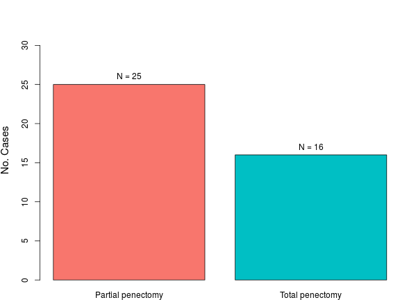 

```r
descriptive.categorical(Var)
```


|                  | No. Cases | %  |
|:-----------------|:---------:|:--:|
|Partial penectomy |    25     | 61 |
|Total penectomy   |    16     | 39 |

_Number of missing cases: 0 cases._

***

#### Histologic Subtype

```r
Var <- Data$Subtype
categorical.plot(Var, align = "h", left =8)
```

 

```r
descriptive.categorical(Var)
```


|          | No. Cases |  %   |
|:---------|:---------:|:----:|
|Usual     |    24     | 58.5 |
|Verrucous |     7     | 17.1 |
|Papillary |     3     |  7.3 |
|Warty     |     3     |  7.3 |
|Mixed     |     4     |  9.8 |

_Number of missing cases: 0 cases._

***

#### Anatomical Location

```r
Var <- Data$Anatomical
categorical.plot(Var, align = "h", left = 14)
```

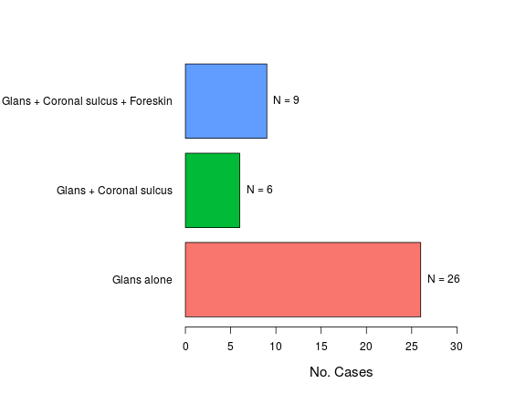 

```r
descriptive.categorical(Var)
```


|                                  | No. Cases | %  |
|:---------------------------------|:---------:|:--:|
|Glans alone                       |    26     | 63 |
|Glans + Coronal sulcus            |     6     | 15 |
|Glans + Coronal sulcus + Foreskin |     9     | 22 |

_Number of missing cases: 0 cases._

***

#### Anatomical Level of Maximum Tumor Invasion

```r
Var <- Data$Level
categorical.plot(Var, align = "h", left = 9)
```

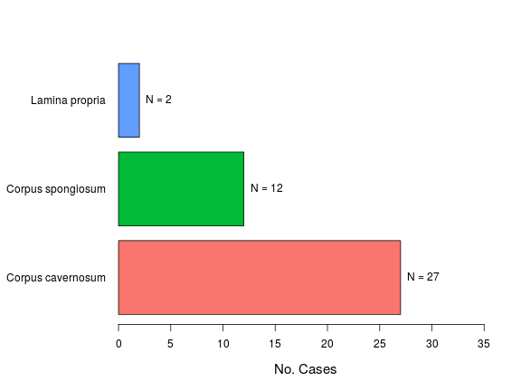 

```r
descriptive.categorical(Var)
```


|                  | No. Cases |  %   |
|:-----------------|:---------:|:----:|
|Corpus cavernosum |    27     | 65.9 |
|Corpus spongiosum |    12     | 29.3 |
|Lamina propria    |     2     |  4.9 |

_Number of missing cases: 0 cases._

***

#### Tumor Size, cm

```r
Var <- Data$Size
numerical.plot(Var, label = "Tumor Size, cm")
```

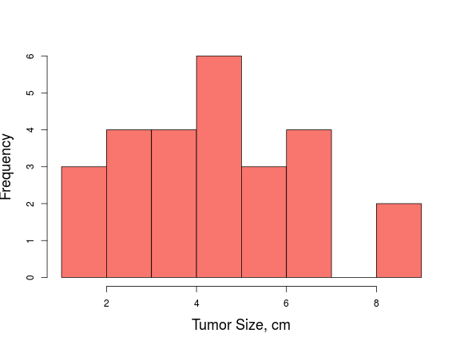  

```r
descriptive.numerical(Var)
```


|Statistics          | Values |
|:-------------------|:------:|
|Mean                |  4.8   |
|Standard Deviation  |   2    |
|Median              |   5    |
|Interquartile Range |  2.9   |
|Mininum             |  1.3   |
|Maximum             |   9    |

_Number of missing cases: 15 cases._

***

#### Patient's Age, years

```r
Var <- Data$Age
numerical.plot(Var, label = "Patient's Age, years")
```

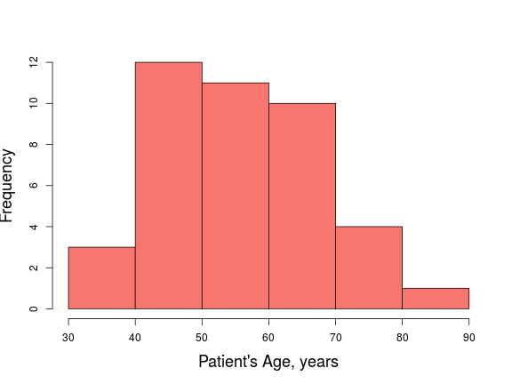  

```r
descriptive.numerical(Var)
```


|Statistics          | Values |
|:-------------------|:------:|
|Mean                |  56.2  |
|Standard Deviation  |  12.3  |
|Median              |   55   |
|Interquartile Range |   19   |
|Mininum             |   33   |
|Maximum             |   85   |

_Number of missing cases: 0 cases._

***

#### Bilateral Inguinal Lymphadenectomy

```r
Var <- Data$Lymphadenectomy
categorical.plot(Var)
```

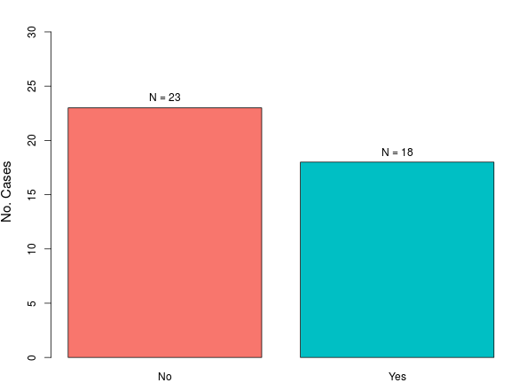 

```r
descriptive.categorical(Var)
```


|    | No. Cases | %  |
|:---|:---------:|:--:|
|No  |    23     | 56 |
|Yes |    18     | 44 |

_Number of missing cases: 0 cases._

***

#### Inguinal Lymph Node Metastasis

```r
Var <- Data$Mets
categorical.plot(Var)
```

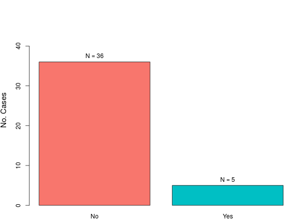 

```r
descriptive.categorical(Var)
```


|    | No. Cases | %  |
|:---|:---------:|:--:|
|No  |    36     | 88 |
|Yes |     5     | 12 |

_Number of missing cases: 0 cases._

***

#### Tumor Invasion of Penile Urethra

```r
Var <- Data$Urethra
categorical.plot(Var)
```

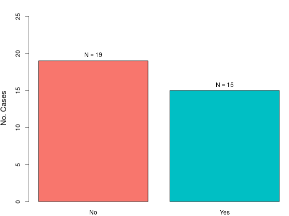 

```r
descriptive.categorical(Var)
```


|    | No. Cases | %  |
|:---|:---------:|:--:|
|No  |    19     | 56 |
|Yes |    15     | 44 |

_Number of missing cases: 7 cases._

***

#### Vascular Invasion

```r
Var <- Data$Vascular
categorical.plot(Var)
```

 

```r
descriptive.categorical(Var)
```


|    | No. Cases | %  |
|:---|:---------:|:--:|
|No  |    36     | 90 |
|Yes |     4     | 10 |

_Number of missing cases: 1 cases._

***

#### Perineural Invasion

```r
Var <- Data$Perineural
categorical.plot(Var)
```

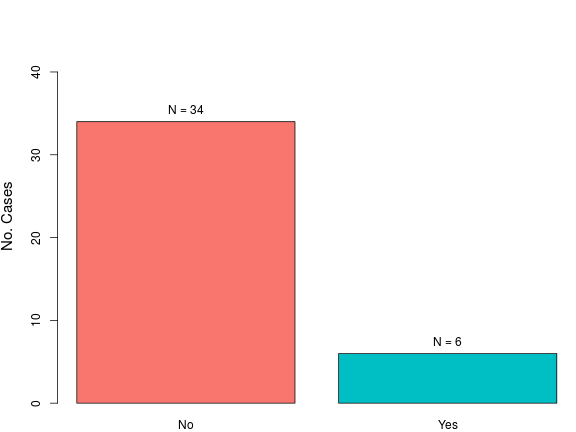 

```r
descriptive.categorical(Var)
```


|    | No. Cases | %  |
|:---|:---------:|:--:|
|No  |    34     | 85 |
|Yes |     6     | 15 |

_Number of missing cases: 1 cases._

***

#### Pathological T Stage

```r
Var <- Data$pT
categorical.plot(Var)
```

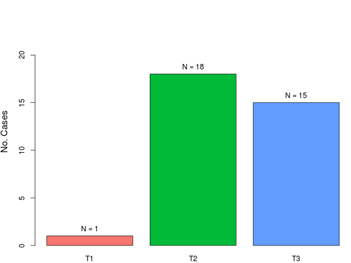 

```r
descriptive.categorical(Var)
```


|   | No. Cases |  %   |
|:--|:---------:|:----:|
|T1 |     1     |  2.9 |
|T2 |    18     | 52.9 |
|T3 |    15     | 44.1 |

_Number of missing cases: 7 cases._

***

#### Tumor Relapse (Local, Regional or Systemic)

```r
Var <- Data$Relapse
categorical.plot(Var)
```

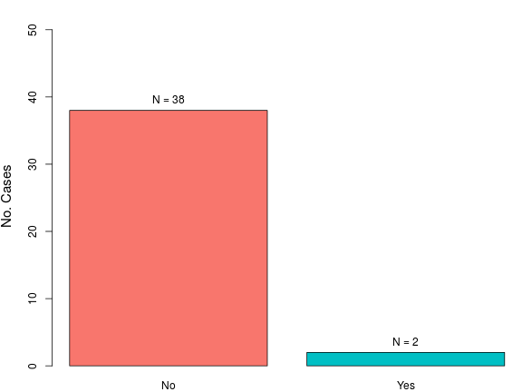 

```r
descriptive.categorical(Var)
```


|    | No. Cases | %  |
|:---|:---------:|:--:|
|No  |    38     | 95 |
|Yes |     2     |  5 |

_Number of missing cases: 1 cases._

***

#### Follow-up Length, months

```r
Var <- Data$FollowUp
numerical.plot(Var, label = "Follow-Up, Months")
```

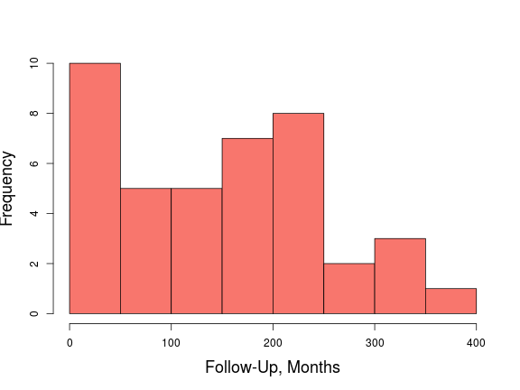  

```r
descriptive.numerical(Var)
```


|Statistics          | Values |
|:-------------------|:------:|
|Mean                | 152.5  |
|Standard Deviation  |  101   |
|Median              | 157.3  |
|Interquartile Range | 143.6  |
|Mininum             |  0.8   |
|Maximum             | 386.7  |

_Number of missing cases: 0 cases._

***

#### Patient's Outcome

```r
Var <- Data$Outcome
categorical.plot(Var)
```

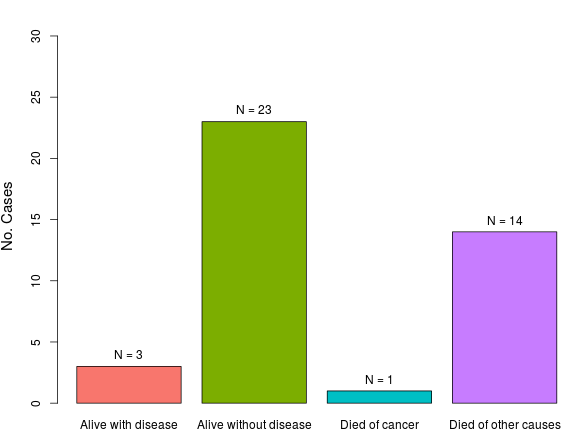 

```r
descriptive.categorical(Var)
```


|                      | No. Cases |  %   |
|:---------------------|:---------:|:----:|
|Alive with disease    |     3     |  7.3 |
|Alive without disease |    23     | 56.1 |
|Died of cancer        |     1     |  2.4 |
|Died of other causes  |    14     | 34.1 |

_Number of missing cases: 0 cases._

***

#### Clinical N Stage

```r
Var <- Data$cN
categorical.plot(Var)
```

 

```r
descriptive.categorical(Var)
```


|    | No. Cases | %  |
|:---|:---------:|:--:|
|cN0 |    20     | 50 |
|cN1 |     7     | 18 |
|cN2 |    13     | 32 |

_Number of missing cases: 1 cases._

***

#### Final Nodal Status

```r
Var <- Data$Final_Nodal
categorical.plot(Var)
```

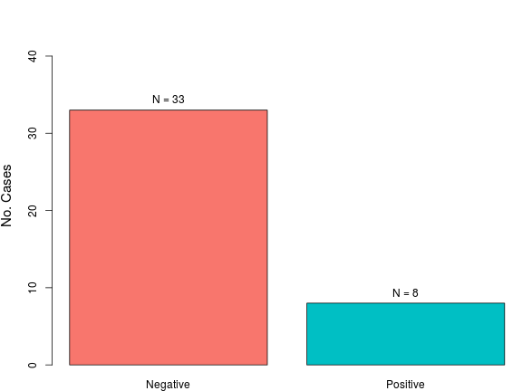 

```r
descriptive.categorical(Var)
```


|         | No. Cases | %  |
|:--------|:---------:|:--:|
|Negative |    33     | 80 |
|Positive |     8     | 20 |

_Number of missing cases: 0 cases._

***

#### Cancer-Related Death

```r
Var <- Data$DOD
categorical.plot(Var)
```

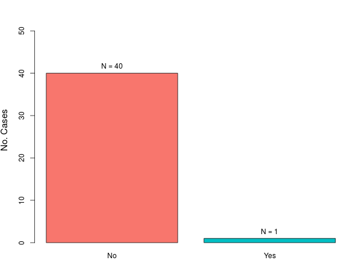 

```r
descriptive.categorical(Var)
```


|    | No. Cases |  %   |
|:---|:---------:|:----:|
|No  |    40     | 97.6 |
|Yes |     1     |  2.4 |

_Number of missing cases: 0 cases._

***

### <a name="Inferential">Inferential Statistics</a>

```r
Var2 <- Data$Paradoxical
```

#### Tumor Type and Surgical Procedure

```r
Var1 <- Data$Procedure
categorical.group.plot(Var1, Var2)
```

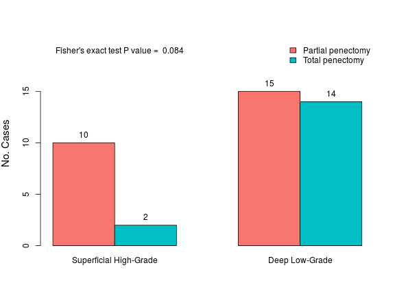 

```r
descriptive.categorical.group(Var1, Var2)
```


|                  | Superficial High-Grade |  %   | Deep Low-Grade |  %   |
|:-----------------|:----------------------:|:----:|:--------------:|:----:|
|Partial penectomy |           10           | 83.3 |       15       | 51.7 |
|Total penectomy   |           2            | 16.7 |       14       | 48.3 |

***

#### Tumor Type and Anatomical Location

```r
Var1 <- Data$Anatomical
categorical.group.plot(Var1, Var2)
```

 

```r
descriptive.categorical.group(Var1, Var2)
```


|                                  | Superficial High-Grade |  %   | Deep Low-Grade |  %   |
|:---------------------------------|:----------------------:|:----:|:--------------:|:----:|
|Glans alone                       |           7            | 58.3 |       19       | 65.5 |
|Glans + Coronal sulcus            |           2            | 16.7 |       4        | 13.8 |
|Glans + Coronal sulcus + Foreskin |           3            | 25.0 |       6        | 20.7 |

***

#### Tumor Type and Anatomical Level

```r
Var1 <- Data$Level
categorical.group.plot(Var1, Var2)
```

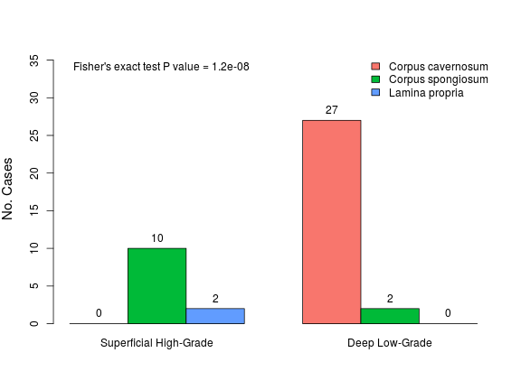 

```r
descriptive.categorical.group(Var1, Var2)
```


|                  | Superficial High-Grade |  %   | Deep Low-Grade |  %   |
|:-----------------|:----------------------:|:----:|:--------------:|:----:|
|Corpus cavernosum |           0            | 0.0  |       27       | 93.1 |
|Corpus spongiosum |           10           | 83.3 |       2        | 6.9  |
|Lamina propria    |           2            | 16.7 |       0        | 0.0  |

***

#### Tumor Type and Tumor Size

```r
Var1 <- Data$Size
numerical.group.plot(Var1, Var2)
```

 

```r
descriptive.numerical.group(Var1, Var2)
```


|                    | Superficial High-Grade | Deep Low-Grade |
|:-------------------|:----------------------:|:--------------:|
|Mean                |          4.8           |      4.8       |
|Standard Deviation  |          3.0           |      1.7       |
|Median              |          4.5           |      5.0       |
|Interquartile Range |          4.1           |      2.1       |
|Minimum             |          1.3           |      2.0       |
|Maximum             |          9.0           |      9.0       |

***

#### Tumor Type and Patient's Age

```r
Var1 <- Data$Age
numerical.group.plot(Var1, Var2)
```

 

```r
descriptive.numerical.group(Var1, Var2)
```


|                    | Superficial High-Grade | Deep Low-Grade |
|:-------------------|:----------------------:|:--------------:|
|Mean                |          50.8          |      58.4      |
|Standard Deviation  |          10.5          |      12.4      |
|Median              |          52.5          |      56.0      |
|Interquartile Range |          12.5          |      19.0      |
|Minimum             |          33.0          |      37.0      |
|Maximum             |          69.0          |      85.0      |

***

#### Tumor Type and Urethral Invasion

```r
Var1 <- Data$Urethra
categorical.group.plot(Var1, Var2)
```

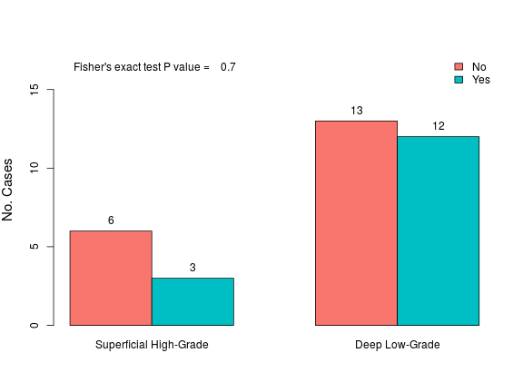 

```r
descriptive.categorical.group(Var1, Var2)
```


|    | Superficial High-Grade |  %   | Deep Low-Grade | %  |
|:---|:----------------------:|:----:|:--------------:|:--:|
|No  |           6            | 66.7 |       13       | 52 |
|Yes |           3            | 33.3 |       12       | 48 |

***

#### Tumor Type and Vascular Invasion

```r
Var1 <- Data$Vascular
categorical.group.plot(Var1, Var2)
```

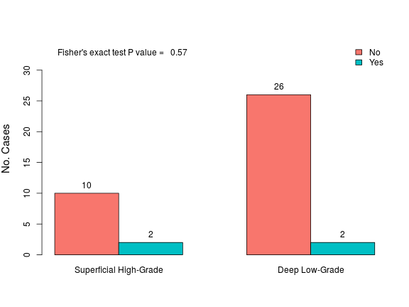 

```r
descriptive.categorical.group(Var1, Var2)
```


|    | Superficial High-Grade |  %   | Deep Low-Grade |  %   |
|:---|:----------------------:|:----:|:--------------:|:----:|
|No  |           10           | 83.3 |       26       | 92.9 |
|Yes |           2            | 16.7 |       2        | 7.1  |

***

#### Tumor Type and Perineural Invasion

```r
Var1 <- Data$Perineural
categorical.group.plot(Var1, Var2)
```

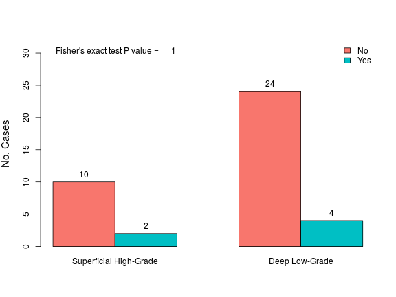 

```r
descriptive.categorical.group(Var1, Var2)
```


|    | Superficial High-Grade |  %   | Deep Low-Grade |  %   |
|:---|:----------------------:|:----:|:--------------:|:----:|
|No  |           10           | 83.3 |       24       | 85.7 |
|Yes |           2            | 16.7 |       4        | 14.3 |

***

#### Tumor Type and cN Stage

```r
Var1 <- Data$cN
categorical.group.plot(Var1, Var2)
```

 

```r
descriptive.categorical.group(Var1, Var2)
```


|    | Superficial High-Grade |  %   | Deep Low-Grade |  %   |
|:---|:----------------------:|:----:|:--------------:|:----:|
|cN0 |           8            | 66.7 |       12       | 42.9 |
|cN1 |           0            | 0.0  |       7        | 25.0 |
|cN2 |           4            | 33.3 |       9        | 32.1 |

***

#### Tumor Type and pT Stage

```r
Var1 <- Data$pT
categorical.group.plot(Var1, Var2)
```

 

```r
descriptive.categorical.group(Var1, Var2)
```


|   | Superficial High-Grade |  %   | Deep Low-Grade | %  |
|:--|:----------------------:|:----:|:--------------:|:--:|
|T1 |           1            | 11.1 |       0        | 0  |
|T2 |           5            | 55.6 |       13       | 52 |
|T3 |           3            | 33.3 |       12       | 48 |

***

#### Tumor Type and Inguinal LN Metastasis

```r
Var1 <- Data$Mets
categorical.group.plot(Var1, Var2)
```

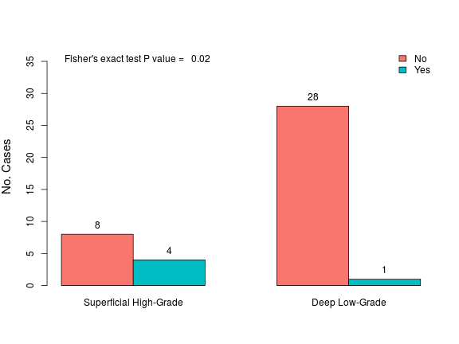 

```r
descriptive.categorical.group(Var1, Var2)
```


|    | Superficial High-Grade |  %   | Deep Low-Grade |  %   |
|:---|:----------------------:|:----:|:--------------:|:----:|
|No  |           8            | 66.7 |       28       | 96.6 |
|Yes |           4            | 33.3 |       1        | 3.4  |

***

#### Tumor Type and Tumor Relapse

```r
Var1 <- Data$Relapse
categorical.group.plot(Var1, Var2)
```

 

```r
descriptive.categorical.group(Var1, Var2)
```


|    | Superficial High-Grade |  %   | Deep Low-Grade |  %   |
|:---|:----------------------:|:----:|:--------------:|:----:|
|No  |           11           | 91.7 |       27       | 96.4 |
|Yes |           1            | 8.3  |       1        | 3.6  |

***

#### Tumor Type and Final Nodal Status

```r
Var1 <- Data$Final_Nodal
categorical.group.plot(Var1, Var2)
```

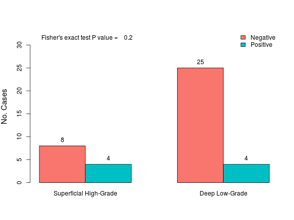 

```r
descriptive.categorical.group(Var1, Var2)
```


|         | Superficial High-Grade |  %   | Deep Low-Grade |  %   |
|:--------|:----------------------:|:----:|:--------------:|:----:|
|Negative |           8            | 66.7 |       25       | 86.2 |
|Positive |           4            | 33.3 |       4        | 13.8 |

***

#### Tumor Type and Cancer-Related Death

```r
Var1 <- Data$DOD
categorical.group.plot(Var1, Var2)
```

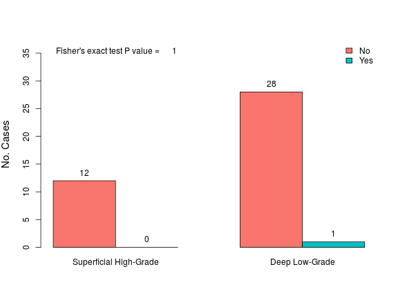 

```r
descriptive.categorical.group(Var1, Var2)
```


|    | Superficial High-Grade |  %  | Deep Low-Grade |  %   |
|:---|:----------------------:|:---:|:--------------:|:----:|
|No  |           12           | 100 |       28       | 96.6 |
|Yes |           0            |  0  |       1        | 3.4  |

***

### <a name="Survival_FN">Survival Analysis: Final Nodal Status</a>

```r
x.lab <- "Follow-Up, Months"
y.lab <- "Survival Function"
# Defining outcome variable
Status <- Data$Final_Nodal
# Creating dicotomic variables from numerical variables for plotting
Size_Median <- factor(ifelse(Data$Size > median(Data$Size, na.rm = TRUE),
  c("Above Median Size"), c("Below Median Size")))
Age_Median <- factor(ifelse(Data$Age > median(Data$Age, na.rm = TRUE),
  c("Above Median Age"), c("Below Median Age")))
# By type of tumor
with(Data, survival.plot(Paradoxical, FollowUp, Status,
  xlab = x.lab, ylab = y.lab,
  title = "Final Nodal Status by Tumor Type"))
```

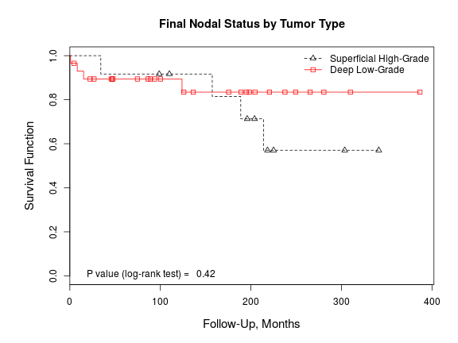 

```r
# By surgical procedure
with(Data, survival.plot(Procedure, FollowUp, Status,
  xlab = x.lab, ylab = y.lab,
  title = "Final Nodal Status by Surgical Procedure"))
```

 

```r
# By anatomical location
with(Data, survival.plot(Anatomical, FollowUp, Status,
  xlab = x.lab, ylab = y.lab, ylim = c(0, 1.09),
  title = "Final Nodal Status by Anatomical Location"))
```

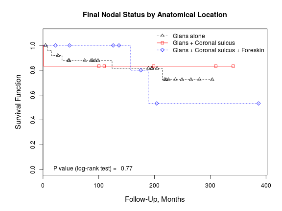 

```r
# By anatomical level
with(Data, survival.plot(Level, FollowUp, Status,
  xlab = x.lab, ylab = y.lab, ylim = c(0, 1.09),
  title = "Final Nodal Status by Anatomical Level"))
```

 

```r
# By median tumor size
with(Data, survival.plot(Size_Median, FollowUp, Status,
  xlab = x.lab, ylab = y.lab,
  title = "Final Nodal Status by Median Tumor Size"))
```

 

```r
# By median patient's age
with(Data, survival.plot(Age_Median, FollowUp, Status,
  xlab = x.lab, ylab = y.lab,
  title = "Final Nodal Status by Median Patient's Age"))
```

 

```r
# By urethral invasion
with(Data, survival.plot(Urethra, FollowUp, Status,
  xlab = x.lab, ylab = y.lab,
  title = "Final Nodal Status by Urethral Invasion"))
```

 

```r
# By vascular invasion
with(Data, survival.plot(Vascular, FollowUp, Status,
  xlab = x.lab, ylab = y.lab,
  title = "Final Nodal Status by Vascular Invasion"))
```

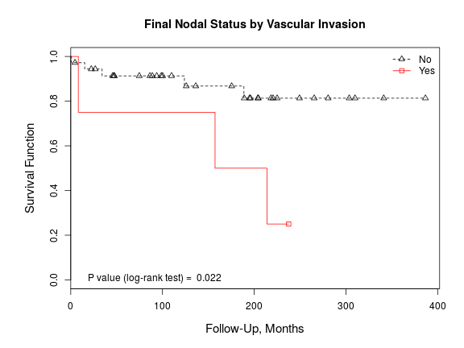 

```r
# By perineural invasion
with(Data, survival.plot(Perineural, FollowUp, Status,
  xlab = x.lab, ylab = y.lab,
  title = "Final Nodal Status by Perineural Invasion"))
```

 

```r
# By pathological T stage
with(Data, survival.plot(pT, FollowUp, Status,
  xlab = x.lab, ylab = y.lab,
  title = "Final Nodal Status by Pathological T Stage"))
```

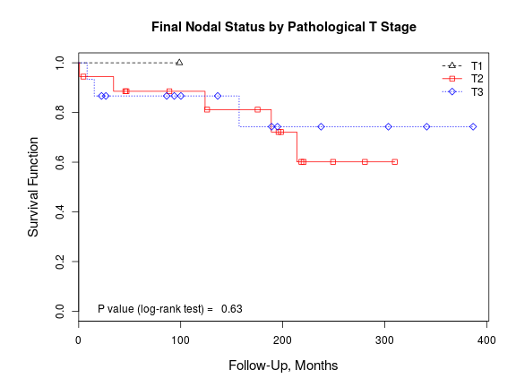 

```r
# By clinical N stage
with(Data, survival.plot(cN, FollowUp, Status,
  xlab = x.lab, ylab = y.lab,
  title = "Final Nodal Status by Clinical N Stage"))
```

 

### <a name="Survival_DOD">Survival Analysis: Cancer-Related Death</a>

```r
# Defining outcome variable
Status <- Data$DOD
# Creating dicotomic variables from numerical variables for plotting
Size_Median <- factor(ifelse(Data$Size > median(Data$Size, na.rm = TRUE),
  c("Above Median Size"), c("Below Median Size")))
Age_Median <- factor(ifelse(Data$Age > median(Data$Age, na.rm = TRUE),
  c("Above Median Age"), c("Below Median Age")))
# By type of tumor
with(Data, survival.plot(Paradoxical, FollowUp, Status,
  ylim = c(0.6, 1), position = "bottomright", xlab = x.lab, ylab = y.lab,
  title = "Cancer-Related Death by Tumor Type"))
```

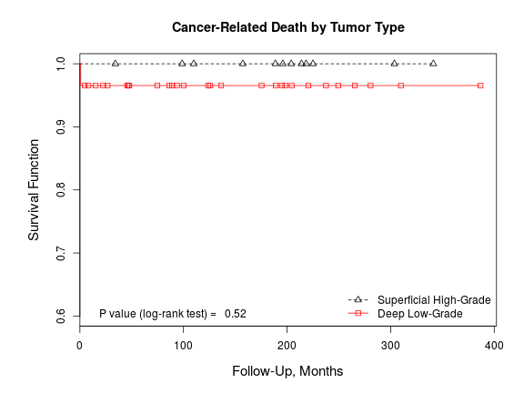 

```r
# By surgical procedure
with(Data, survival.plot(Procedure, FollowUp, Status,
  ylim = c(0.6, 1), position = "bottomright", xlab = x.lab, ylab = y.lab,
  title = "Cancer-Related Death by Surgical Procedure"))
```

 

```r
# By anatomical location
with(Data, survival.plot(Anatomical, FollowUp, Status,
  ylim = c(0.6, 1), position = "bottomright", xlab = x.lab, ylab = y.lab,
  title = "Cancer-Related Death by Anatomical Location"))
```

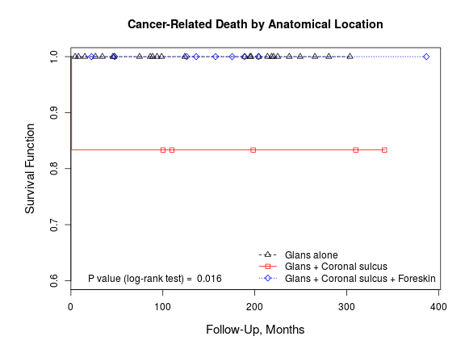 

```r
# By anatomical level
with(Data, survival.plot(Level, FollowUp, Status,
  ylim = c(0.6, 1), position = "bottomright", xlab = x.lab, ylab = y.lab,
  title = "Cancer-Related Death by Anatomical Level"))
```

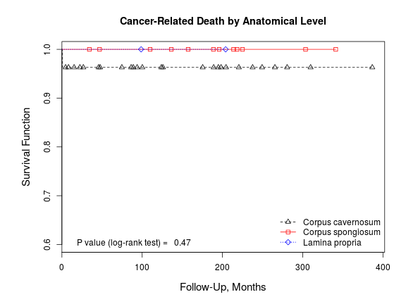 

```r
# By median tumor size
with(Data, survival.plot(Size_Median, FollowUp, Status,
  ylim = c(0.6, 1), position = "bottomright", xlab = x.lab, ylab = y.lab,
  title = "Cancer-Related Death by Median Tumor Size"))
```

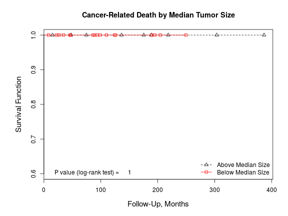 

```r
# By median patient's age
with(Data, survival.plot(Age_Median, FollowUp, Status,
  ylim = c(0.6, 1), position = "bottomright", xlab = x.lab, ylab = y.lab,
  title = "Cancer-Related Death by Median Patient's Age"))
```

 

```r
# By urethral invasion
with(Data, survival.plot(Urethra, FollowUp, Status,
  ylim = c(0.6, 1), position = "bottomright", xlab = x.lab, ylab = y.lab,
  title = "Cancer-Related Death by Urethral Invasion"))
```

 

```r
# By vascular invasion
with(Data, survival.plot(Vascular, FollowUp, Status,
  ylim = c(0.6, 1), position = "bottomright", xlab = x.lab, ylab = y.lab,
  title = "Cancer-Related Death by Vascular Invasion"))
```

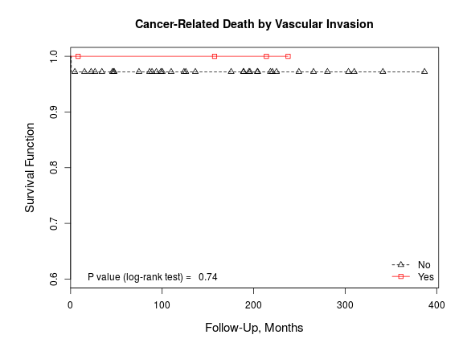 

```r
# By perineural invasion
with(Data, survival.plot(Perineural, FollowUp, Status,
  ylim = c(0.6, 1), position = "bottomright", xlab = x.lab, ylab = y.lab,
  title = "Cancer-Related Death by Perineural Invasion"))
```

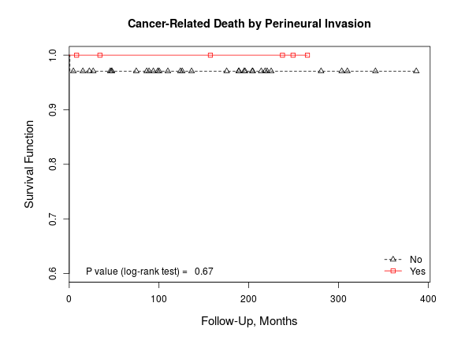 

```r
# By pathological T stage
with(Data, survival.plot(pT, FollowUp, Status,
  ylim = c(0.6, 1), position = "bottomright", xlab = x.lab, ylab = y.lab,
  title = "Cancer-Related Death by Pathological T Stage"))
```

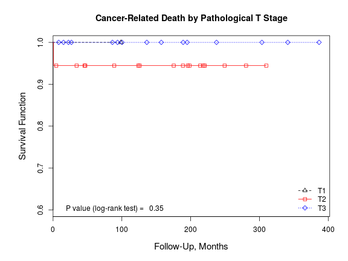 

```r
# By clinical N stage
with(Data, survival.plot(cN, FollowUp, Status,
  ylim = c(0.6, 1), position = "bottomright", xlab = x.lab, ylab = y.lab,
  title = "Cancer-Related Death by Clinical N Stage"))
```

 

***

### <a name="OR">Logistic Regression Analysis</a>

```r
# Creating variables for GLM analysis
Paradoxical_Inv <- factor(Data$Paradoxical,
  levels = c("Deep Low-Grade", "Superficial High-Grade"))
Data$Multicompartment <- factor(ifelse(Data$Anatomical == "Glans alone",
  c("No"), c("Yes")))
Data$CC <- factor(ifelse(Data$Level == "Corpus cavernosum",
  c("Yes"), c("No")))
Data$High_pT <- factor(ifelse(Data$pT == "T3",
  c("Yes"), c("No")))
Data$cN_Positive <- factor(ifelse(Data$cN == "cN0",
  c("No"), c("Yes")))
# Creating list of variables and labels
Predictors <- with(Data, list(
  "Superficial high-grade vs. deep low-grade" = Paradoxical_Inv,
  "Primary treatment" = Procedure,
  "Age > median" = Age_Median,
  "Tumor affecting multiple anatomical compartments" = Multicompartment,
  "Invasion of corpus cavernosum" = CC,
  "Tumor size > median" = Size_Median,
  "Invasion of penile urethra" = Urethra,
  "Vascular invasion" = Vascular,
  "Perineural invasion" = Perineural,
  "High pT (>pT3)" = High_pT,
  "Positive clinical nodes" = cN_Positive
  ))
Varlabels <- names(Predictors)
```

***

#### Inguinal Lymph Node Metastasis

```r
Outcome <- Data$Mets
logistic.table(Outcome, Predictors, Varlabels)
```


|Variables                                        |   OR    | Lower 95% CI | Higher 95% CI | P value |
|:------------------------------------------------|:-------:|:------------:|:-------------:|:-------:|
|Superficial high-grade vs. deep low-grade        |  14.00  |     1.77     |    295.70     |  0.026  |
|Primary treatment                                | 1.3e-08 |      NA      |   2.1e+117    |   0.99  |
|Age > median                                     |  0.53   |    0.064     |     3.59      |   0.52  |
|Tumor affecting multiple anatomical compartments |  1.18   |     0.14     |     8.03      |   0.87  |
|Invasion of corpus cavernosum                    |  0.096  |    0.0046    |     0.75      |  0.047  |
|Tumor size > median                              |  1.07   |    0.088     |     25.05     |   0.96  |
|Invasion of penile urethra                       |  0.27   |    0.013     |     2.09      |   0.26  |
|Vascular invasion                                |  11.00  |     1.03     |    127.12     |   0.04  |
|Perineural invasion                              |  5.17   |     0.56     |     42.50     |   0.12  |
|High pT (>pT3)                                   |  0.27   |    0.013     |     2.09      |   0.26  |
|Positive clinical nodes                          |  1.59   |     0.24     |     13.20     |   0.63  |

*** 

#### Tumor Relapse

```r
Outcome <- Data$Relapse
logistic.table(Outcome, Predictors, Varlabels)
```


|Variables                                        |   OR    | Lower 95% CI | Higher 95% CI | P value |
|:------------------------------------------------|:-------:|:------------:|:-------------:|:-------:|
|Superficial high-grade vs. deep low-grade        |  2.45   |    0.092     |     65.89     |   0.54  |
|Primary treatment                                |  1.71   |    0.064     |     45.68     |   0.71  |
|Age > median                                     |  0.81   |     0.03     |     21.49     |   0.88  |
|Tumor affecting multiple anatomical compartments | 1.4e-08 |      NA      |      Inf      |      1  |
|Invasion of corpus cavernosum                    |  0.52   |    0.019     |     13.87     |   0.65  |
|Tumor size > median                              |  0.50   |    0.018     |     13.76     |   0.64  |
|Invasion of penile urethra                       |  1.21   |    0.045     |     32.60     |   0.89  |
|Vascular invasion                                | 1.4e-07 |      NA      |   2.4e+227    |      1  |
|Perineural invasion                              |  6.40   |     0.23     |    180.98     |   0.21  |
|High pT (>pT3)                                   |  1.21   |    0.045     |     32.60     |   0.89  |
|Positive clinical nodes                          | 9.5e+07 |   1.8e-282   |      NA       |      1  |

*** 

#### Final Nodal Status

```r
Outcome <- Data$Final_Nodal
logistic.table(Outcome, Predictors, Varlabels)
```


|Variables                                        |  OR   | Lower 95% CI | Higher 95% CI | P value |
|:------------------------------------------------|:-----:|:------------:|:-------------:|:-------:|
|Superficial high-grade vs. deep low-grade        | 3.12  |     0.61     |     16.27     |   0.16  |
|Primary treatment                                | 0.45  |     0.06     |     2.31      |   0.37  |
|Age > median                                     | 0.44  |     0.08     |     2.11      |   0.31  |
|Tumor affecting multiple anatomical compartments | 1.05  |     0.19     |     5.08      |   0.95  |
|Invasion of corpus cavernosum                    | 0.43  |    0.086     |     2.17      |    0.3  |
|Tumor size > median                              | 0.75  |     0.10     |     6.70      |   0.78  |
|Invasion of penile urethra                       | 0.70  |     0.12     |     3.48      |   0.67  |
|Vascular invasion                                | 18.60 |     1.96     |    421.69     |  0.019  |
|Perineural invasion                              | 5.80  |     0.87     |     40.60     |  0.064  |
|High pT (>pT3)                                   | 0.70  |     0.12     |     3.48      |   0.67  |
|Positive clinical nodes                          | 1.89  |     0.40     |     10.50     |   0.43  |

*** 

#### Cancer-Related Death

```r
Outcome <- Data$DOD
Predictors <- Predictors[-grep("Tumor size > median", Varlabels)]
Varlabels <- names(Predictors)
logistic.table(Outcome, Predictors, Varlabels)
```


|Variables                                        |   OR    | Lower 95% CI | Higher 95% CI | P value |
|:------------------------------------------------|:-------:|:------------:|:-------------:|:-------:|
|Superficial high-grade vs. deep low-grade        | 3.3e-08 |      NA      |      Inf      |      1  |
|Primary treatment                                | 1.5e+08 |     0.00     |      NA       |      1  |
|Age > median                                     | 7.7e-09 |      NA      |      Inf      |      1  |
|Tumor affecting multiple anatomical compartments | 1.7e+08 |     0.00     |      NA       |      1  |
|Invasion of corpus cavernosum                    | 3.3e+07 |     0.00     |      NA       |      1  |
|Invasion of penile urethra                       | 2.1e-08 |      NA      |      Inf      |      1  |
|Vascular invasion                                | 1.1e-07 |      NA      |      Inf      |      1  |
|Perineural invasion                              |  1e-07  |      NA      |      Inf      |      1  |
|High pT (>pT3)                                   | 2.1e-08 |      NA      |      Inf      |      1  |
|Positive clinical nodes                          | 8.2e-09 |      NA      |      Inf      |      1  |

*** 
